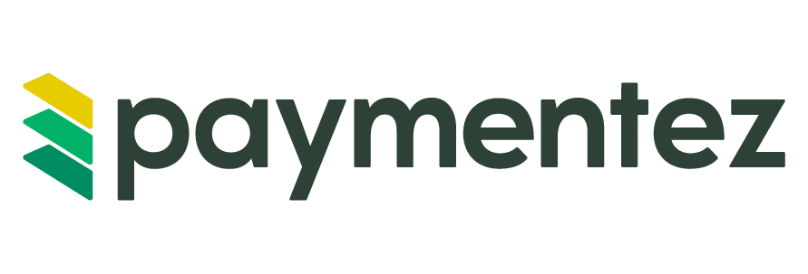

Este SDK para [Paymentez](https://paymentez.github.io/api-doc/#introduction) 💳, desarrollado por la comunidad de [Flutter Ecuador](https://twitter.com/flutter_ec) 🇪🇨, **NO ES UNA SOLUCIÓN OFICIAL DE PAYMENTEZ**, pero surge como respuesta a la creciente demanda de integraciones robustas y eficientes en el ecosistema de pagos digitales. Identificamos una necesidad significativa entre las empresas y desarrolladores que enfrentan dificultades y dudas al intentar integrar servicios de Paymentez en sus aplicaciones Flutter.

*PaymentezSDK* una solución estable, eficiente y fácil de implementar 😱. ofreciendo una experiencia de integración sin fisuras en aplicaciones Dart y Flutter. Con un enfoque en la estabilidad y cobertura de código completa, este SDK es ideal tanto para empresas 🏢 como para 🧑🏻‍💻desarrolladores👨🏻‍💻 independientes que buscan integrar las capacidades de pago avanzadas de Paymentez, evitando las complicaciones técnicas habituales 🙄.

**📑 NOTA:** Es importante 👀 destacar que Paymentez ha sido adquirida por [Nuvie](https://nuvei.com). Como resultado de esta adquisición, los servicios de Paymentez continuarán estando disponibles exclusivamente en Ecuador hasta el año 2027-2028 🗓.

🤝🏼 Prometemos a Futuro dar soporte para [Nuvie](https://nuvei.com) 🖊.

## Características
PaymentezSDK ofrece una gama completa de funcionalidades para facilitar y optimizar la integración de pagos en sus aplicaciones Flutter. Estas son algunas de las características clave:
#### Gestión del Baúl de Paymentez
**🆕 Crear Tarjetas 💳:** Permite a los usuarios añadir tarjetas de crédito/débito al baúl de Paymentez de forma segura.
**🔍 Listar Tarjetas 💳:** Obtenga una lista de todas las tarjetas guardadas asociadas a un usuario.
**🗑️ Eliminar Tarjetas 💳:** Ofrece a los usuarios la posibilidad de eliminar tarjetas guardadas en el baúl de Paymentez.

#### Procesamiento de Pagos
**🔐 Con PCI:** Permite procesar pagos directamente, manejando datos de tarjetas y cumpliendo con los estándares de seguridad de PCI.
**🕋 Sin PCI usando el bauld:** Facilita el procesamiento de pagos sin manejar directamente los datos de la tarjeta, utilizando el sistema de baul de Paymentez.
**🔙 Devoluciones:** Capacidad integrada para realizar devoluciones de pagos, permitiendo una gestión completa del ciclo de vida de las transacciones.
**🛡️ 3D Secure:** Incorpora métodos para soportar la autenticación 3D Secure, añadiendo una capa adicional de seguridad en las transacciones en línea.
**📧 Validación de Pagos con OTP:** Permite la validación de pagos mediante el uso de OTP, asegurando una mayor seguridad y cumplimiento en las transacciones.

## Instalación
Nunca debe exponer sus credenciales de servidor en el código del lado del cliente de ningún sitio web público.

Para iniciar la integración, deberá solicitar a [Nuvie](https://nuvei.com) Team Integrations@paidez.com una cuenta de Desarrollo/Sandbox. Por favor envíanos tu correo electrónico para identificarte como desarrollador y el nombre de tu empresa.
### Configuración Inicial
```dart
final sdk = PaymentezSDK(
    clientApplicationCode: 'APP.....CODE.....CLIENT',
    clientAppKey: 'L38fv.....KEY.....RXQoz',
    serverApplicationCode: 'APP.....CODE.....SERVER',
    serverAppKey: 'voRXQ.....KEY......Kn9v6I',
);
```
### Ejemplos de Uso
#### Guardar un Tarjeta
Es una función típicamente utilizada en plataformas de procesamiento de pagos como Paymentez para agregar una tarjeta de crédito o débito en un baúl de protección donde se tokenizan las tarjetas agregadas para garantizar la seguridad y la privacidad de los datos, donde cada tarjeta agregada está vinculada a un usuario específico.
```dart
final addCardRequest = AddCardRequest(
    user: UserCard(
        id: '5a9b9072-4d60-4846-be71-d533d3851901',
        email: 'test@example.com',
    ),
    card: NewCard(
        number: '4111111111111111',
        holderName: 'citlali calderon',
        expiryMonth: 9,
        expiryYear: 2025,
        cvc: '123',
    ),
);

final (addCardResponse, paymentezError) = await sdk.addCard(addCardRequest);
```

#### Eliminar Tarjeta:
La eliminación de una tarjeta del baul de protección de Paymentez es un proceso seguro que garantiza que la información de la tarjeta se elimine completamente de la base de datos. Esto es crucial para mantener la seguridad de los datos del usuario y para darles control sobre sus métodos de pago almacenados. La función deleteCard es especialmente importante para gestionar tarjetas que han expirado, se han perdido o han sido reemplazadas.
```dart

```
#### Listar Tarjetas guardafas:
Esta lista incluye detalles relevantes como el tipo de tarjeta, los últimos cuatro dígitos, la fecha de vencimiento y el nombre del titular, proporcionando una manera clara y segura de visualizar y gestionar sus métodos de pago. Esta función es útil para que los usuarios revisen rápidamente sus tarjetas guardadas y seleccionen la más adecuada para sus transacciones.
```dart

```
#### Pay with token card
Esta función permite a los usuarios realizar compras utilizando una orden tokenizada. En este método, la información de la tarjeta del usuario ya ha sido previamente tokenizada y almacenada de forma segura. Al realizar una compra, el usuario simplemente referencia el token de su tarjeta almacenado, en lugar de ingresar los detalles de la tarjeta cada vez. Esto no solo agiliza el proceso de compra, sino que también mejora la seguridad, ya que los datos sensibles de la tarjeta no se transmiten durante la transacción. Es ideal para los usuarios que realizan compras recurrentes o quieren una experiencia de pago más rápida y segura.
```dart
final model = PayRequest(
    user: UserPay(
        id: '5a9b9072-4d60-4846-be71-d533d3851901',
        email: 'test@example.com',
        phone: '+593555555555',
    ),
    order: OrderPay(
        taxPercentage: 12,
        taxableAmount: 292.86,
        vat: 35.14,
        amount: 328,
        description: 'pozole',
        devReference: 'cod_order_buy_001',
    ),
    card: CardToken(
        token: '14329172493919123772',
    ),
);

final (payResponse, paymentezError) = await sdk.debit(model);
```


#### Pay with card direct 
Esta función permite a los usuarios realizar compras ingresando los detalles de su tarjeta de crédito o débito directamente en cada transacción. A diferencia de las órdenes tokenizadas, aquí se proporciona la información de la tarjeta en cada compra, lo que puede ser preferible para usuarios que no desean almacenar sus datos de tarjeta o para transacciones únicas. A pesar de requerir más pasos en cada compra, esta opción mantiene altos estándares de seguridad, incluyendo la validación de datos y posiblemente la autenticación 3D Secure, para proteger contra el fraude y el uso indebido de la tarjeta.
```dart
final payPCIRequest = PayPCIRequest(
    user: UserPay(
        id: '5a9b9072-4d60-4846-be71-d533d3851901',
        email: 'test@example.com',
        phone: '+593555555555',
    ),
    order: OrderPay(
        taxPercentage: 12,
        taxableAmount: 292.86,
        vat: 35.14,
        amount: 328,
        description: 'pozole',
        devReference: 'cod_order_buy_001',
    ),
    card: CardPCI(
        number: '4111111111111111',
        holderName: 'citlali calderon',
        expiryMonth: 9,
        expiryYear: 2025,
        cvc: '123',
    ),
);

final (payResponse, paymentezError) = await sdk.debitCC(payPCIRequest);
```
### Manejo de Errores

## Contribuciones
Este SDK, fruto de la colaboración entre la 🧔🏻 comunidad 👩🏻 y empresas 🏢, valoramos enormemente las contribuciones para su mejora y expansión 🙏. Invitamos a contribuir con correcciones, mejoras o nuevas funcionalidades a través de pull requests 🧪 o issues🐞. Agradecemos especialmente a colaboradores destacados como: 

🇪🇨 [agilerdev](https://github.com/agilerdev) - Flutter Ecuador

🧙‍♂️ [Alfredo32231](https://github.com/Alfredo32231) - Unidad Educativa Leonardo da Vinci

🇪🇨 [br-programmer](https://github.com/br-programmer) - Flutter Ecuador

🇵🇪 [CristhianLara1996](https://github.com/CristhianLara1996) - Flutter Peru

『』[jose10395](https://github.com/jose10395) - Qhubit

🤜🏻 Juntos 🤛🏻, podemos seguir mejorando esta herramienta vital para la comunidad de desarrolladores Flutter y Paymentez 🤗.
</div>